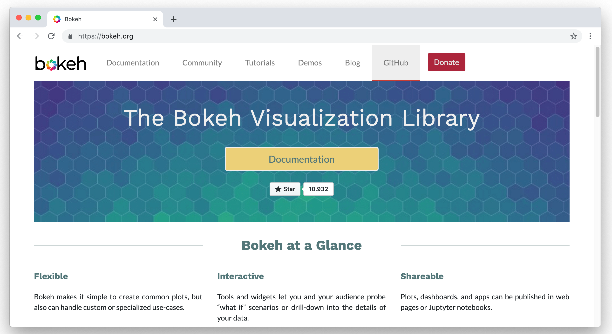

# Bokeh Official Website

This repository contains the source code for the official website [bokeh.org](https://bokeh.org). The source code and issue tracker for Bokeh itself can be found at [github.com/bokeh/bokeh](https://github.com/bokeh/bokeh).



## Developing with Docker

#### Requirements:
 - [Docker](https://docs.docker.com/v17.12/install/)

Verify the above requirements by running `docker version` from the command line.

1. Clone the project repository
2. Remove any Gemfile[.lock] from the project root directory
3. Run `make serve` to build and serve the website from within a [`jekyll`](https://hub.docker.com/r/jekyll/jekyll/) container.
4. Natigate to `http://localhost:4000`

```
git clone https://github.com/bokeh/bokeh.org.git
cd bokeh.org
rm -f Gemfile Gemfile.lock
make serve
```

While running Jekyll will automatically rebuild the site and refresh the browser when changes are made to the source code.
